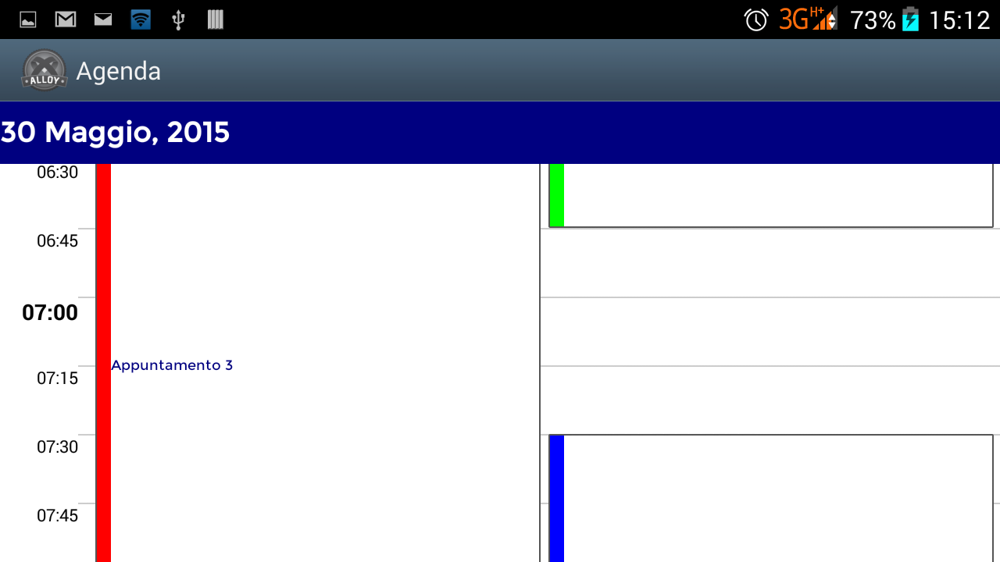

<h1>GiuspelDayViewerProject</h1>

<b>*EXPERIMENTAL*</b> - This is an experimental project for Giuspel Titanium Widget Calendar.

<h3><i>Images ... </i></h3> 

<table border="0">
<tr>
<td>
	
</td>
<td>
	
</td>
</tr>
</table>

<h4>How to use this widget</h4>

<h4>.. in a controller</h4>

<h3>Next steps ... </h3>

<h4>	1. Managing 'onClick' event on appointment</h4>
<h4>	2. Managing 'onScroll' date event on day widget</h4>
	
	
